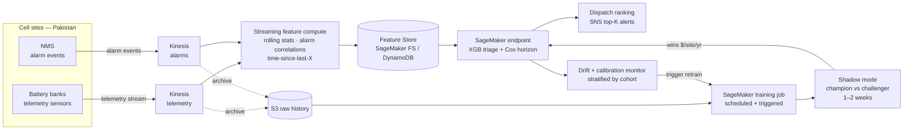

# Day 1 — Theory Brief v2: Real-Time PdM for Telecom Battery Infrastructure

**Project:** Predictive maintenance for cell-site backup batteries — Pakistan / South-Asia operating context
**Stack:** Streaming features (Kinesis) + XGBoost (survival objective) + Cox PH + champion-challenger retraining on AWS
**Defends bullet:** Etisalat / PTCL
**Day 1 scope:** problem framing, data dictionary, repo skeleton, synthetic data + alarm-stream generator. No model code yet.

---

## 1. The business problem

A telecom operator owns N cell sites. Each has a backup battery bank — VRLA lead-acid in legacy networks (your PTCL/Etisalat era), increasingly Li-ion. The job: keep the BTS/BBU online when grid power dies. In Pakistan, grid load-shedding is *daily* — 4–12 hours per day in some regions — so batteries are deeply cycled every day. That regime accelerates capacity fade and gives you, ironically, a uniquely rich training signal: many discharge events per battery per month.

Failure is two-stage: gradual capacity fade (months → years) → inability to sustain a discharge during the *next* grid event → site outage → SLA penalty + customer-experience hit + emergency truck roll into a remote site.

The business is not asking "will this battery fail?" It is asking:
> "Given a fixed maintenance budget of K truck rolls per quarter, which sites should I dispatch to, in what order, with what lead time?"

That reframing forces three model properties: **ranking under a budget**, an **explicit time horizon**, and **honest treatment of censoring** (most batteries in your training set haven't failed yet — coding them as negatives is statistically wrong and operationally dangerous).

That is why this project uses **XGBoost + Cox PH** stacked, served from a real-time scoring layer fed by streaming telemetry and NMS alarm events.

### Pakistan domain context that shapes the design

- **Heat.** Lahore/Karachi summers run 45°C+. Battery lifetime halves roughly every 8–10°C above 25°C — Arrhenius behavior is the dominant aging mechanism in this market.
- **Load shedding.** Frequent deep cycling, not occasional emergency discharges. Discharge-depth distribution per site is itself a feature.
- **Genset backup.** Many sites have diesel gensets behind the battery; their availability is part of the failure-cost calculation.
- **Theft.** A meaningful fraction of "battery failures" in rural sites are theft events, not capacity failures. Different label, different action — your data layer needs to keep them separate.

---

## 2. Voltage hierarchy primer (shapes feature engineering)

`-48V` is the *nominal* bus voltage of a telecom DC plant — not a failure value. The hierarchy you'll see in the NMS:

| State | Approx voltage | Meaning |
|---|---|---|
| Float | -54.0 to -54.5V | Rectifier holding battery topped up; healthy steady-state |
| Nominal bus | -48V | System designation; what the load sees |
| On discharge (start) | ~-52V | Grid lost, battery taking load |
| Low-voltage alarm | ~-46 to -45V | Early warning |
| Battery-low alarm | ~-44V | Minutes before LVD |
| LVD (low-voltage disconnect) | ~-42V | Load dropped to preserve cells |

Failure-relevant signals are **not** "voltage equals -48V". They are:
- **Trajectory under discharge.** dV/dt under known load is a direct capacity indicator. Healthy batteries fall slowly; sulfated cells fall fast.
- **Deviation from float during grid-up.** Cells that can't hold -54V are sulfated.
- **Float-voltage variance across strings.** String-to-string drift is an early imbalance signal.

These are the features Cox and XGBoost will eat. None of them are simple thresholds.

---

## 3. Data sources

| Stream | Type | Frequency | Examples |
|---|---|---|---|
| `telemetry_stream` | Continuous (Kinesis) | 1–5 min/site | bus_voltage, charge_current, discharge_current, ambient_temp, battery_temp |
| `alarm_stream` | Event-based (Kinesis) | Variable | rectifier_module_fail, mains_fail, low_voltage, battery_low, door_open, etc., with raise_ts and clear_ts |
| `site_metadata` | Static | Reference | site_id, region, climate_zone, battery_manufacturer, install_date, capacity_ah, n_strings, has_genset |
| `failure_events` | Derived | — | Joined from alarm × outage × maintenance — your label table |
| `maintenance_log` | Append-only | Per truck-roll | replacement events, reason codes — *informative censoring lives here* |

The alarm stream is the unlock. It gives you (a) precise ground-truth labels via `battery-low → outage` sequences, (b) leading indicators (rectifier alarms fire days/weeks before battery-low), and (c) a natural multi-horizon framing: short-horizon ("this discharge cycle ends in outage") for triage, long-horizon ("this battery has 60 days of useful life") for capex planning.

---

## 4. Classification vs survival — the framing dilemma

| Lens | What it estimates | Strength | Weakness |
|---|---|---|---|
| Binary classification (XGBoost) | P(fail in next Δt \| x) | Captures non-linearities, fast, well-tooled | Throws away time info; censoring → label noise; Δt arbitrary |
| Cox PH | h(t \| x) | Proper censoring; lifetime distribution; interpretable hazard ratios | Linear-in-x in log hazard; PH assumption can break |
| Random Survival Forest | Same target, non-parametric | Drops PH assumption; non-linear | Less interpretable; harder ops story |
| DeepSurv / DeepHit | NN-parameterized survival | Rich interactions | Sample-hungry; opaque; ops trust low |
| `xgboost survival:cox` | Cox partial likelihood as XGB loss | Non-linear *and* censoring-aware | Less interpretable than vanilla Cox |
| `xgboost survival:aft` | Accelerated failure time | Non-linear; gives lifetime, not just hazard | Strong distributional assumption |

**Senior take:** ship Cox PH for the planning horizon and interpretability, ship XGBoost (with `survival:cox` objective) for short-horizon triage and feature interactions, stack them. RSF and DeepSurv go in the "Models Considered" table; you justify *why you didn't ship them*.

---

## 5. Cox proportional hazards — the math

Hazard:

$$h(t \mid x) = \lim_{\Delta t \to 0} \frac{P(t \leq T < t + \Delta t \mid T \geq t, x)}{\Delta t}$$

Cox specification:

$$h(t \mid x) = h_0(t) \cdot \exp(\beta^\top x)$$

Baseline hazard \(h_0(t)\) is left **unspecified**. Estimate \(\beta\) via partial likelihood:

$$L(\beta) = \prod_{i:\, \delta_i = 1} \frac{\exp(\beta^\top x_i)}{\sum_{j \in R(t_i)} \exp(\beta^\top x_j)}$$

\(\delta_i = 1\) if event observed; \(R(t_i)\) is the risk set at time \(t_i\).

**Why this works:**
- Censored subjects contribute through risk sets up to censoring time.
- \(\beta\) is interpretable: 1-unit increase in feature \(k\) → instantaneous failure rate scales by \(\exp(\beta_k)\).
- No distributional assumption on lifetime — only that hazard ratios are constant over time.

**Testing PH:** Schoenfeld residuals. Non-zero correlation with time → \(\beta_k\) varying → PH violated for feature \(k\). Fix by stratifying on it (separate baseline hazards) or adding a time-interaction term.

**Survival evaluation:**
- **C-index** — P(model orders comparable pairs correctly). The AUC of survival.
- **Time-dependent Brier / IBS** — calibration over the prediction window.
- **IPCW** — corrects metrics for non-uniform censoring distribution.

---

## 6. Real-time architecture

**Boundary discipline (the senior point):**
- **Streaming side:** rolling-window features (last-15-min dV/dt, last-24h alarm counts by type, time-since-last-mains-fail, discharge-depth-rolling-mean). Computed online, written to feature store. The *same code path* used to recompute features for training data from S3 — eliminates train/serve skew.
- **Batch / pre-computed:** historical aggregates (per-site failure base rate, per-cohort hazard, manufacturer prior). Refreshed nightly.
- **Static:** site metadata, install date, manufacturer.
- **Inference cadence:** score on every alarm event (cheap, meaningful), not every telemetry tick (wasteful).
- **Training plane stays batch.** Online learning is deliberately out — see §8.

---

## 7. Where XGBoost fits

Cox PH is linear in \(x\) in the log hazard — cannot natively express "voltage sag pattern × ambient temp × age cohort". XGBoost can. So:

- **Short-horizon binary triage** ("fails in next 24–72h") on streaming features.
- **Survival-aware objectives.** `survival:cox` minimizes Cox partial likelihood with tree splits — keeps censoring honest while capturing non-linear interactions. `survival:aft` parameterizes lifetime directly. Both genuinely useful, both under-used in industry.
- **Stacked into Cox.** XGBoost score becomes a covariate in Cox PH — lets you keep Cox's interpretability for the headline hazard ratios while letting XGBoost handle interaction structure.

---

## 8. Retraining loop — production-grade, not online

**Deliberately out: online learning.** Continuous weight updates from a live stream are wrong for this problem. Label latency is weeks-to-months (a battery's failure is observed long after the prediction). Failures are rare events (gradient signal-to-noise is brutal). Cox partial likelihood doesn't online-update cleanly. And auditability: ops needs to reproduce why Site X was dispatched on Tuesday and not Wednesday — that requires a frozen, versioned model, not a continuously-mutating one.

**In scope: scheduled + triggered batch retraining with these production-grade properties.**

1. **Shadow-mode challengers.** New model scores in parallel with champion for 1–2 weeks. Decisions logged, not acted on. Statistical comparison on realized outcomes before promotion.
2. **Stratified drift detection.** PSI/KS per cohort (manufacturer, region, install-year), not global. Catches a hot summer in Sindh that global drift would average out.
3. **Calibration-triggered retrain.** Beyond feature drift — fire retrain when realized Brier score or calibration slope on rolling 30-day labels degrades, even if features look stable.
4. **Performance attribution on retrain triggers.** When C-index drops, log which feature distributions moved most. Distinguishes real drift from a data pipeline issue (telemetry packet loss, alarm taxonomy change).
5. **Promotion criterion is cost-sensitive, not C-index.** A challenger wins only if it lowers $/site/year on a held-out cohort, not just AUC. CIs reported on the cost differential.
6. **Rollback path.** Every promoted model has an automated rollback procedure — Step Functions encodes it.

**This is the senior signal.** "Online inference + online features + scheduled-and-triggered retraining with shadow mode and cost-sensitive promotion" is the production pattern for rare-event PdM. If asked "why not online?", that's the answer.

---

## 9. Senior considerations beyond the loop

**Cost-sensitive operating point.** Bring `$/site/year` vs dispatch threshold to the review meeting, not an ROC curve. Cost truck rolls, SLA penalties, replacement, churn delta — the right threshold falls out.

**Calibration > AUC under budgets.** A 0.8-AUC miscalibrated model still triages badly. Plan for Platt or isotonic post-calibration on a held-out fold.

**Alarm correlation / de-dup.** NMS data is famously noisy — one rectifier failure can spawn 30 cascading alarms in two minutes. Build a root-cause grouping layer before features so you train on alarm *sequences*, not alarm *storms*. Call this out in your README — it's interview gold.

**Informative censoring.** Preemptive replacement during a regional sweep is *not* the same as end-of-study censoring. Treat them as different events in the data layer; pooling biases \(\beta\) downward.

**Theft vs capacity failure.** Two different failure modes, two different actions. Your label pipeline must separate them.

**Group-aware CV.** Battery → site → region clustering means failures are correlated. Naive KFold leaks. Split on site (or region, depending on cohort size) — non-negotiable.

**Interpretability is operational.** Field ops needs hazard ratios or SHAP, not a softmax. This is also why DeepSurv stays out even if it wins on C-index.

---

## 10. Models considered (preview — completed across Days 2–4)

| Model | Why considered | Why kept / dropped | Decision |
|---|---|---|---|
| Logistic regression | Baseline | Misses interactions; sanity check | Keep as baseline |
| XGBoost binary | Triage | Ignores censoring naively | Replace with `survival:cox` |
| XGBoost `survival:cox` | Non-linear + censoring-aware | Ship for triage layer | **Ship** |
| Cox PH | Planning horizon + interpretability | PH testable & fixable | **Ship** |
| Stacked (XGB → Cox) | Best of both | Adds complexity but justifiable | **Ship** |
| RSF | Drops PH assumption | Less interpretable; harder ops story | Document, don't ship |
| DeepSurv | Handles interactions | Sample-hungry; opaque | Reject for this scale |
| Weibull AFT | Parametric alt | Strong distributional assumption | Document as ablation |

---

## 11. Day 1 deliverables (this afternoon)

1. `docs/01_problem_framing.md` — written from this brief.
2. `docs/02_data_dictionary.md` — telemetry + alarm + metadata + failure-event schema; censoring rules; theft-vs-capacity label rules.
3. `src/battery_pdm/synth/` — synthetic data generator producing physically-plausible telemetry (voltage curves under discharge, Arrhenius-driven aging, age-cohort hazards, manufacturer effects, regional clustering) **and** an alarm-stream generator that emits cascading NMS-style alarms with realistic raise/clear timestamps.
4. Repo skeleton conforming to your project template.

The synthetic generator is a senior skill in itself — interviewers love "what would you do without data?" Realism here is the message.

---

## 12. Seven questions — answer before we touch code

1. **Censoring framing.** A battery is preemptively replaced at month 18 during a regional sweep — no observed failure. How do you encode this in survival training data, and is it the same as a battery still alive at month 36 (end of observation)? Defend.

2. **Operating point.** Truck roll = $400. Avoidable outage = $2,500 (SLA + churn). Battery replacement = $600 either way. Write expected cost per site as a function of dispatch threshold \(p^*\); explain how you'd find optimal \(p^*\).

3. **PH assumption violation.** Schoenfeld residual on "ambient temperature exposure" drifts upward with time. Stratify or time-interaction term? Pick one for a deployed system and justify.

4. **CV strategy.** Batteries grouped by site, sites by region, 24-month observation window. Why is naive 5-fold KFold wrong? Specify your CV scheme and what you split on.

5. **Why not just LSTM.** Interviewer: "You've got time-series telemetry per battery — why not just LSTM-classify?" Three-point answer.

6. **Alarm correlation.** Rectifier-module alarm at 14:02. Bus-voltage-low at 14:03. Battery-low at 14:09. Site offline at 14:14. Four events or one? How do you encode this for training, and what feature do you derive from the *sequence* specifically?

7. **Real-time / batch feature boundary.** Three example features per category — streaming, batch-precomputed, static — and justify the split. The train/serve skew implications are the senior point.

---

*Read, answer the seven back to me. No code yet. After your answers I hand over the skeleton for the synthetic + alarm generators and the repo init.*
